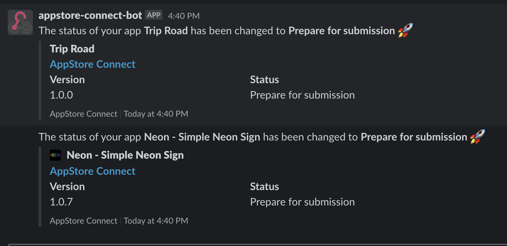

# AppStore Connect Bot

# Intro

AppStore Connect Bot is a node.js app fetches your app info directly from App Store Connect and posts changes in Slack as a Webhooks.
(used of _fastlane_'s [Spaceship](https://github.com/fastlane/fastlane/tree/master/spaceship))

# Preview

# Usage

## 1. Generating Tokens for API Requests

1. Go to [AppStore Connect](https://appstoreconnect.apple.com/) and login.
2. Go to `Users and Access` - `Keys`
3. Generate API Key and Download API Key(p8 file)
