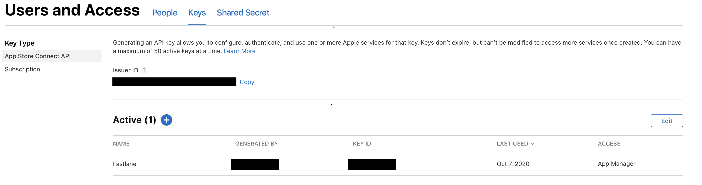

# AppStore Connect Bot

# Intro

AppStore Connect Bot is a node.js app fetches your app info directly from App Store Connect and posts changes in Slack as a Webhooks.
(used of _fastlane_'s [Spaceship](https://github.com/fastlane/fastlane/tree/master/spaceship))

# Preview

# Usage

## 1. Generating API Key

1. Go to [AppStore Connect](https://appstoreconnect.apple.com/) and login.
2. Go to `Users and Access` - `Keys`
3. Generate API Key and Download API Key(p8 file)

## 2. Setting Secrets with your keys.

- Go to `Settings` - `Secrets` - `Add a new secret`

### Secret Values

- See the screenshot below.
  

> PRIVATE_KEY: Input raw data about your downloaded API Key (.p8)  
> KEY_ID : Input AppStore connect `KEY ID`  
> ISSUER_ID : Input AppStore connect `Issuer ID`  
> BUNDLE_ID : Input your bundle_identifier of application (`Optional`) 
> (_If not entered, all app information is fetched._) 
> WEBHOOKS : Input your slack webhook url

## 3. Configure fetch timing or languages

- [fetch.yml](./.github/workflows/fetch.yml)

In `workflow` file, can change lanauges and fetch schedule default `schedule` is every 15 minutes.

# References

- https://github.com/fastlane/fastlane/tree/master/spaceship
- https://github.com/erikvillegas/itunes-connect-slack
- https://github.com/rogerluan/app-store-connect-notifier
- https://github.com/techinpark/appstore-status-bot
